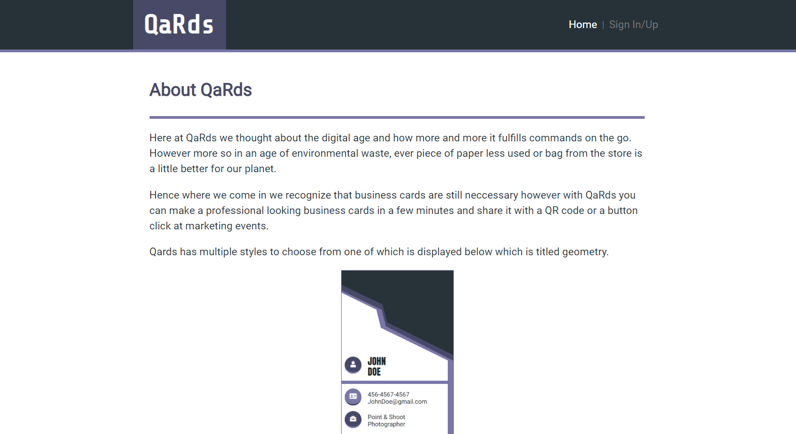

# UFT-Project-2: business-QaRd

**Project 2 for University of Toronto coding Bootcamp.**

**Project Details**

This project focused on using everything we have learnt in the course thus far as a team using.

1. Git version-control system for tracking changes. 
2. Travis and heroku for project continous integration and hosting.
3. Using a QR code generator api we make pathways for our QR cards.
4. Express for handling user profiles and other middleware.

**Application Features**

  * Creates user profiles
  * Creates user account page to accept data
  * Uses user data to populate card with user data
  * Use qr code and share button functionality to share business cards.
    

**Team:**  Andy Durette, Damian Ruiz, Kavian Darvish

**Challenges and technologies used in no particular order.**

* Styling across all viewport and devices
* Session based authetication and database management
* Express package for security
* Continuous integration pipeline.

**Live Demo:** https://business-qard.herokuapp.com/

